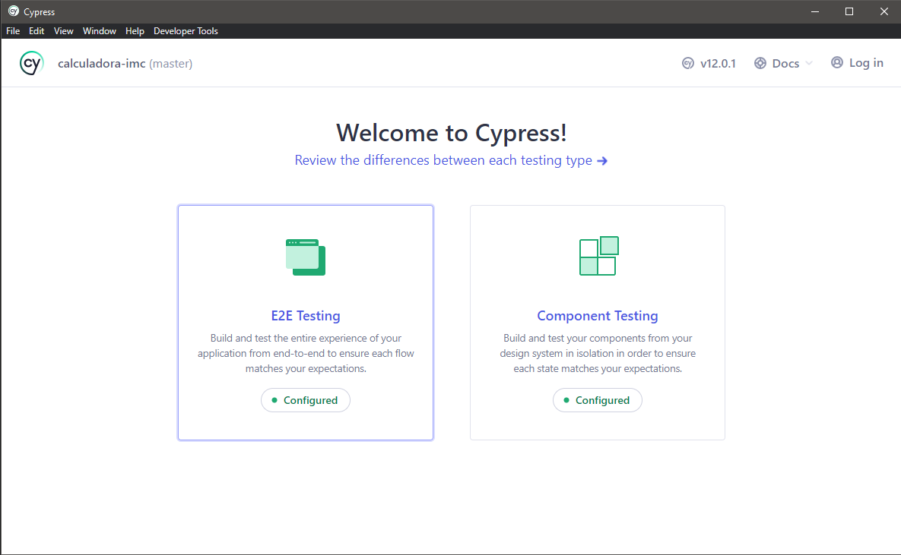
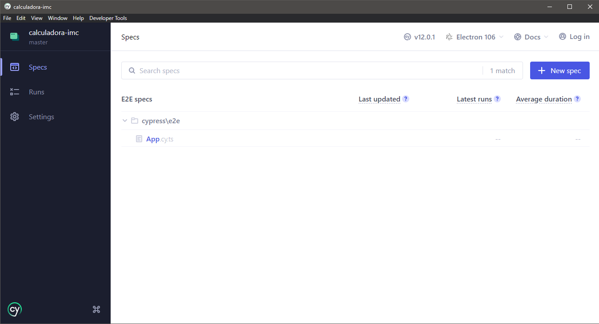

## 🚀 Instalando Calculadora_IMC

Para instalar o projeto, siga estas etapas:

```
git clone git@github.com:LucasCavalheri/calculadora-imc.git
```

Entre na pasta que você acabou de clonar.

Abra o terminal e digite:

```
npm install (ou npm i)
```

## 💻 Executando o Projeto

Para abrir o projeto no navegador, digite:

```
npm run dev
```

## 📝 Executando os testes

Para executar os testes, primeiro você precisa estar com o projeto rodando no seu navegador com o comando:

```
npm run dev
```

Após isso, você precisa executar o Cypress:

```
npx cypress open
```

* Caso seja a primeira vez que você esteja usando o Cypress, a lentidão para abrir pode ser maior.

* Ao abri-lo, você verá essa tela:



* Clique em "E2E Testing"

* Após isso selecione o seu navegador e clique em "Start E2E Testing in *nomeDoNavegadorEscolhido*"

* Em seguida, você verá essa tela: 



* Clique em "App" e pronto! Os testes começarão a rodar! Caso queira pará-los ou reiniciar os testes, é só apertar a tecla R (Ou Clicar no símbolo ao lado do número de acertos e erros)

## 🤝 Feedbacks

Caso queria dar um feedback, pode me mandar mensagem no meu <a href="https://www.linkedin.com/in/lucas-cavalheri/">LinkedIn</a>
